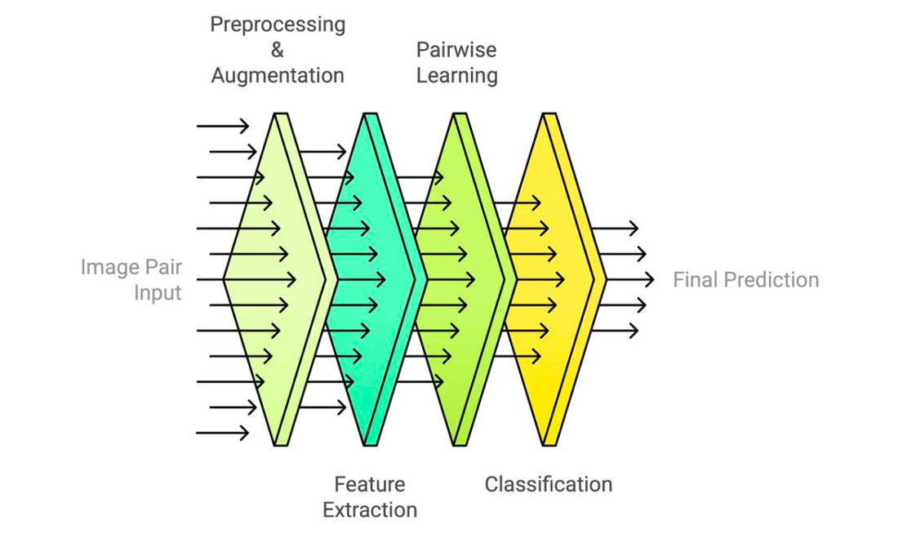

# Enhancing-Deepfake-Detection
This repository presents our research on deepfake detection using paired real and AI-generated images, combining deep learning and contrastive learning techniques. The project investigates the performance of convolutional neural networks (CNNs)—including VGG16, ResNet50, and ConvNeXt—trained on a curated dataset that links each authentic image with its synthetic counterpart. To enhance model robustness and generalization, we introduce a pairwise learning strategy based on contrastive loss, enabling the networks to better distinguish subtle differences between real and fake content. This work contributes to the development of more accurate and scalable detection systems to combat misinformation and preserve trust in digital media.

## Background
Generative Artificial Intelligence has dramatically transformed the landscape of digital media by enabling the creation of highly realistic images, videos, and audio. While these innovations offer exciting possibilities, they also give rise to significant challenges, particularly with the spread of deepfakes—synthetic media designed to closely imitate authentic content. Deepfakes pose serious risks, including the spread of misinformation, diminished public trust in media, and critical security and ethical concerns.

Recognizing these challenges, the ability to accurately detect deepfakes has become increasingly vital. This project is motivated by the urgent demand for more dependable and effective detection systems capable of distinguishing authentic media from AI-generated forgeries. Our approach centers on improving deepfake detection by utilizing a curated dataset that pairs genuine images with their synthetic counterparts. By focusing on both authenticity and forgery detection, we aim to advance the robustness and precision of deepfake identification technologies, contributing to the broader goal of preserving the credibility of digital information

## Architecture


## Repository Structure

- `Classification/`: Classification VGG16, ResNet50, and ConvNeXt
- `Pairwise-learning/`: Classification with Pairwise-learning for VGG16, ResNet50, and ConvNeXt
- `Visualization/`: View dataset samples
- `README.md`: Overview and setup instructions.
- `requirements.txt`: Required libraries for the project.


## Install Requirements
Clone this repository and install the required Python packages:

```bash
git clone (https://github.com/ZainabAldhanhani/Enhancing-Deepfake-Detection.git)
cd Enhancing-Deepfake-Detection
pip install -r requirements.txt
```
## Dataset

This project uses the **AI vs Human Generated Dataset** provided by Shutterstock and DeepMedia via Kaggle.

The dataset consists of paired authentic and AI-generated images, with each real image matched to a synthetic version created using advanced generative models. It includes a balanced mix of content types, including images featuring people, to support robust and diverse model training. The data is divided into `train` and `test` folders, with labels provided only for the training set.

You can download the dataset directly from Kaggle:  
 [https://www.kaggle.com/datasets/alessandrasala79/ai-vs-human-generated-dataset](https://www.kaggle.com/datasets/alessandrasala79/ai-vs-human-generated-dataset)


To explore and verify the dataset structure, we provide a helper script: `preview_dataset.py`. This script offers a quick overview of the dataset and ensures everything is properly organized after downloading it from Kaggle.

Make sure `train.csv` and the `train_data/` folder are in the same directory. Then run:

```bash
python preview_dataset.py /path/to/your_dataset/train
```

